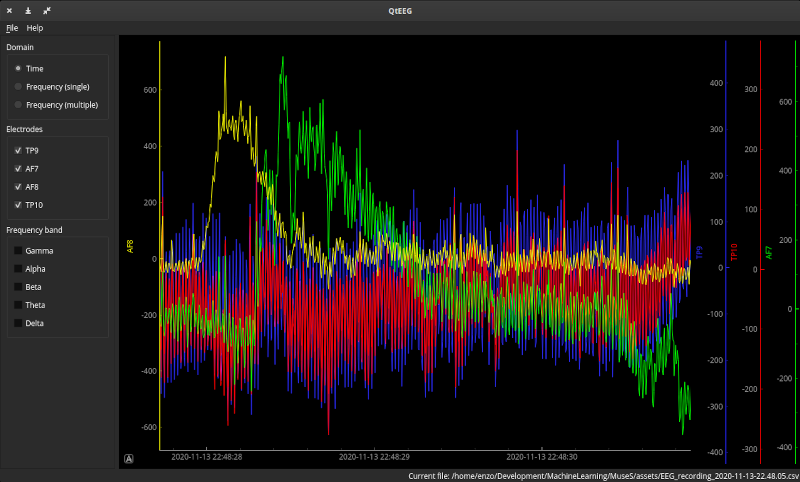
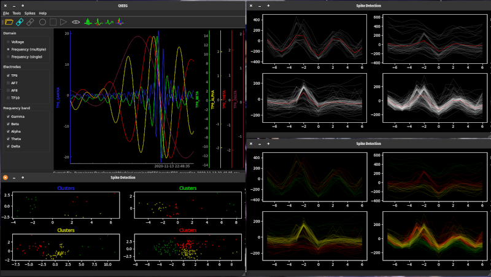

# QtEEG

Simple Qt application to visualise MuseS output.

 

This application will allow to stream and record readings from InteraXon Muse device
as well as visualise stream or csv files with recordings.

### Installation
Package uses [Poetry](https://python-poetry.org).<br/>
To recreate project use command:
```bash
poetry install
```

### Common Issues
https://github.com/alexandrebarachant/muse-lsl/blob/master/README.md#common-issues


##### Using a QRC file
To use qrc file in application in needs to be compiled into Python first.
```bash
pyrcc5 resources.qrc -o resources.py
```

### Acknowledgement
- Connecting, streaming and recording data from Muse S is done using 
https://github.com/alexandrebarachant/muse-lsl
- Spike analysis based on https://github.com/multichannelsystems/McsPyDataTools/blob/master/McsPyDataTools/docs/McsPy-Tutorial_DataAnalysis.ipynb

### Contact
If there is any problem, please rise an issue. 
